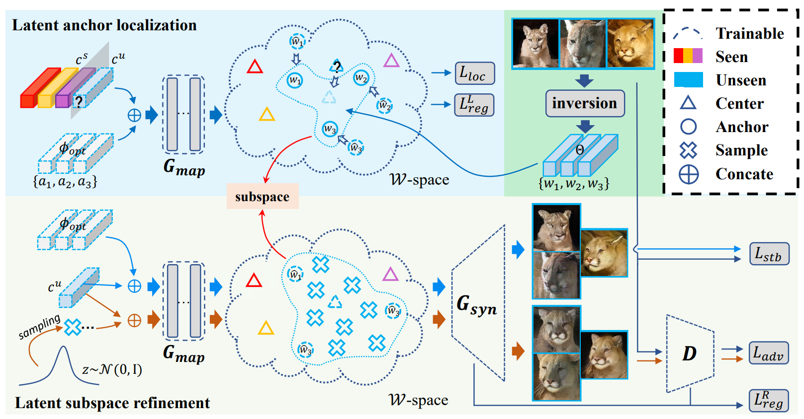

<<<<<<< HEAD
# LSO
Coming soon.
=======
# Latent Subspace Optimization

The official Pytorch implementation of our paper Where is My Spot? Few-shot Image Generation via Latent Subspace Optimization, CVPR 2023.




> Where is My Spot? Few-shot Image Generation via Latent Subspace Optimization
> 
> Chenxi Zheng, Bangzhen Liu, Xuemiao Xu, Huaidong Zhang, and Shengfeng He
> 
> [Paper](https://openaccess.thecvf.com/content/CVPR2023/papers/Zheng_Where_Is_My_Spot_Few-Shot_Image_Generation_via_Latent_Subspace_CVPR_2023_paper.pdf)


## Environment
- Python 3.7
- Pytorch 1.7.1

Prepare the environment using either conda or pip.
```
cd envs
conda env create -f environment.yaml
cd ..
```
```
cd envs
conda create -n LSO python=3.7
conda activate LSO
pip install -r requirements.txt
cd ..
```
If installation of pytorch fails or a custom Pytorch version is needed, please install [pytorch](https://pytorch.org/get-started/previous-versions/) following the [official guidance](https://pytorch.org/get-started/previous-versions/) manually.

## Getting started
Before training, prepare the pretrained ckpts optimized with seen categories.
* Dataset: Follow [LoFGAN](https://github.com/edward3862/LoFGAN-pytorch) and download the [datasets](https://portland-my.sharepoint.com/:f:/g/personal/zhenggu4-c_my_cityu_edu_hk/ErQRAfnkT1xJqaTZwB7ZVWoBrAu86flhwQeuBoHMS-bfVA?e=gaaeAZ).
* Pretrained StyleGAN2: download the pretrained [checkpoints](https://drive.google.com/drive/folders/1SG4lFCGX6YPY32h5Da_5OpYmgX4St-IU?usp=sharing).
* Inverted latent codes: download inverted [latent codes](https://drive.google.com/drive/folders/1SG4lFCGX6YPY32h5Da_5OpYmgX4St-IU?usp=sharing).
* Weights for feature extractor: download the [weights](https://drive.google.com/drive/folders/1SG4lFCGX6YPY32h5Da_5OpYmgX4St-IU?usp=sharing).

Note that the latent codes only contain the subset for image generation $\mathbb{S}_{gen}^{c}$ in Sec. 4.2. For example, the shape of tensor in `flowers_unseen17_0-10_step1300.npy` is $[17*10, 12, 512]$, which is corresponding to the slice $[85:102, 0:10, :, :, :]$ of images in `flower_c8189_s128_data_rgb.npy` which has a tensor shape of $[102, 40, 128, 128, 3]$.

Unzip the files and set up the paths in `configs/default_configs.py`.

```
DATA_PATH = <PATH_TO_DATASET_NPY>
CKPT_PATH = <PATH_TO_STYLEGAN2_CKPT>
WS_PATH = <PATH_TO_WS>
IDCKPT_PATH = <PATH_TO_IDWEIGHTS>
```

## Training
### Multi-task for quantitative evaluation
```shell
python train_unseen.py \
    --outdir <output_dir> \
    --k_shot <k> \
    --dataset_name <dataset_name>
```
* The code does NOT support multi-GPU processing in the current version but allows separate runs for different categories. For instance, execute a run for categories $[0, 8)$ on GPU:0 and execute another for categories $[8, 17)$ on GPU:1. The indices can be specified with `--classes=<start_idx>,<end_idx>`.
* Results are saved in directory `<output_dir>/<run_dir>/few-shot_samples/magnitude=<magnitude-intensity>`. For each category, we randomly generate 128 images for quantitative evaluation.
* Refer to the main definition in `train_unseen.py` for command examples.

### Single-task for detailed visualization
We also provide single-task optimization for visualization and detailed optimization evaluation.
```shell
python train_unseen.py \
    --outdir <output_dir> \
    --k_shot <k> \
    --single_task <cidx> <idx_1,...,idx_k> \
    --dataset_name <dataset_name>
```

* Specify the argument `--single_task` with the category number and the image indices.
* To save the checkpoints, add argument `--save_ckpt` as true.

<!-- 
* You may also customize the parameters in `configs`.
* It takes about 30 hours to train the network on a V100 GPU. -->


## Evaluation
(optional) If the images are generated in the separated runs, use `merger.py` to combine all the images.
```shell
python merger.py \
    --path <output_dir> \
    --idx <runidx_1>,...,<runidx_n>
```
* Refer to the main definition in `merger.py` for command examples.

Quantitative evaluation of the generated images.
```shell
python main_metric_calculate.py \
    --real_dir <real_directory> \
    --fake_dir <fake_directory> \
    --dataset_name <dataset_name>
```
* Refer to the main definition in `main_metric_calculate.py` for command examples.

The calculation of LPIPS is significantly accelerated by first extracting the features of each image. Please refer to `metrics/lpips_fs/lpips_fs.py`.


## Citation
If you use this code for your research, please cite our paper.

    @inproceedings{zheng2023my,
    title={Where Is My Spot? Few-Shot Image Generation via Latent Subspace Optimization},
    author={Zheng, Chenxi and Liu, Bangzhen and Zhang, Huaidong and Xu, Xuemiao and He, Shengfeng},
    booktitle={Proceedings of the IEEE/CVF Conference on Computer Vision and Pattern Recognition},
    pages={3272--3281},
    year={2023}
    }

## Acknowledgement
This project builds upon and has been inspired by the following repositories:

* Training and evaluation code are based on [StyleGAN2-ADA](https://github.com/NVlabs/stylegan2-ada-pytorch) and [LoFGAN](https://github.com/edward3862/LoFGAN-pytorch).

* The code for calculating FID is based on [pytorch-fid](https://github.com/mseitzer/pytorch-fid).

We would like to thank the entire open-source community for fostering an environment of collaboration and knowledge sharing.
## License
This repository is under [MIT license](https://github.com/chansey0529/LSO/LICENSES/LICENSE.txt).
>>>>>>> c2fd1f6 (initial commit)
